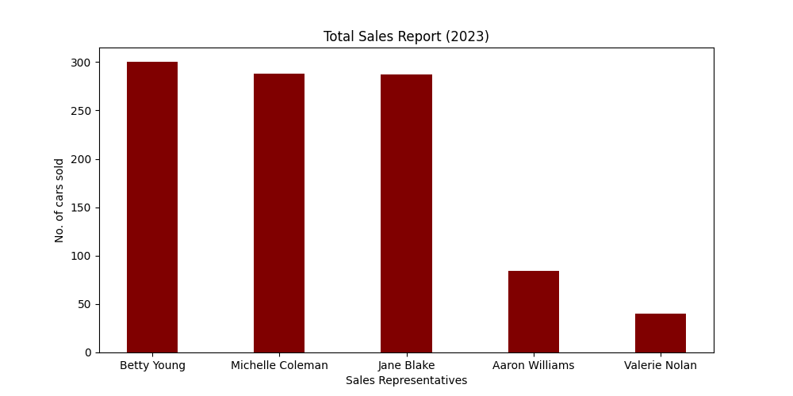
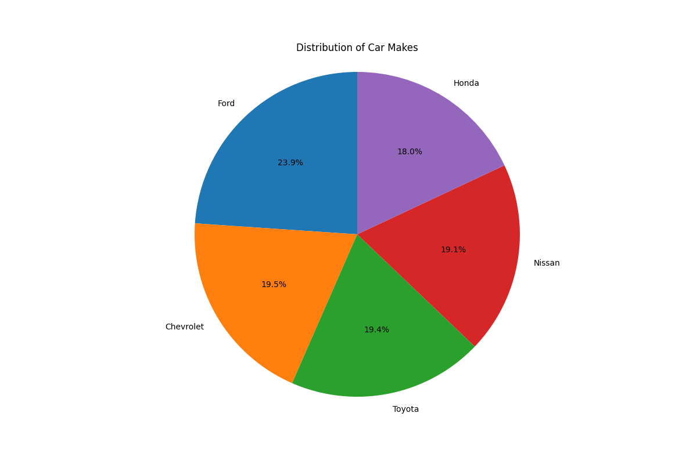
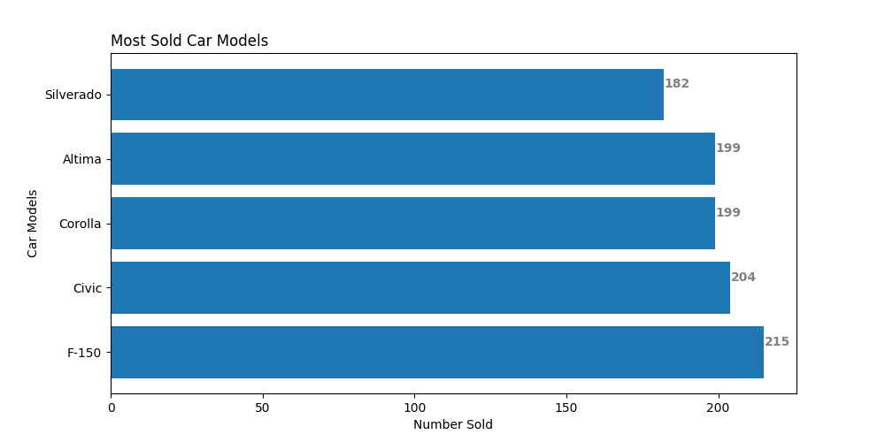

[][def]

# Individual Project 1

## The current implementation of the individual project can be executed as follows:

1. All dependencies needed for execution can be found in the [requirement.txt](https://github.com/nogibjj/oo46_iProject_1/blob/main/requirements.txt) file
2. These dependencies will be installed by github actions using the Make file.

## Individual Project deliverables:

1. [Jupyter Notebook](https://github.com/nogibjj/oo46_iProject_1/blob/main/notebook.ipynb) with:

- Cells that perform descriptive statistics using Pandas.
- Tested by using nbval plugin for pytest

2. [Python Script](https://github.com/nogibjj/oo46_iProject_1/blob/main/script.py) performing the same descriptive statistics using Pandas
3. [lib.py](https://github.com/nogibjj/oo46_iProject_1/blob/main/lib.py) file that shares the common code between the script and notebook
4. [Makefile](https://github.com/nogibjj/oo46_iProject_1/blob/main/Makefile) with the following:

- Run all tests (must test notebook and script and lib)
- Formats code with Python black
- Lints code with Ruff
- Installs code via: pip install -r [requirements.txt](https://github.com/nogibjj/oo46_iProject_1/blob/main/requirements.txt)

5. [test_script.py](https://github.com/nogibjj/oo46_iProject_1/blob/main/test_script.py) to test script
6. [test_lib.py](https://github.com/nogibjj/oo46_iProject_1/blob/main/test_lib.py) to test some library functions
7. GitHub Actions performs all four Makefile commands with badges for
   each one in the README.md

## Testing...

1. A simple testing implementation is provided in myapp/test_script.py, test_lib.py as follows:
   - test_col_exist function --> test for the existence of a column as expected
   - test_my_stats --> uses pandas' assert_frame_equal testing feature to confirm the quality of two dataframes
   - and another testing involving the jupyter notebook using pytest with the nbval plugin.
2. This test wll also be executed by github actions via the make file. However, manual testing can also be done either via Make file.

### Top Sales Report by sales persons from the car sales dataset

### Top Sales Report by car make from the car sales dataset

### Top Sales Report by car model from the car sales dataset

## Video Link...

[Check out this link for a quick intro](https://youtu.be/g4mc7SAnTXs)

[def]: https://https://github.com/nogibjj/oo46_iProject_1/actions/workflows/actions.yml
